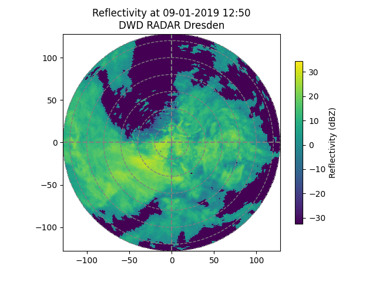

## radar-gauge-adjustment
Shell script for scraping data from DWD's open data server and applying an adjustment for radar rainfall rates with gauge data.

## Packages and Dependencies
certifi            2021.10.8
cftime             1.5.1.1
charset-normalizer 2.0.10
cloudpickle        2.0.0
cycler             0.11.0
dask               2021.12.0
DateTime           4.3
deprecation        2.1.0
fonttools          4.28.5
fsspec             2021.11.1
GDAL               3.4.1
h5netcdf           0.12.0
h5py               3.6.0
idna               3.3
kiwisolver         1.3.2
locket             0.2.1
matplotlib         3.5.1
netCDF4            1.5.8
numpy              1.22.0
packaging          21.3
pandas             1.3.5
partd              1.2.0
Pillow             9.0.0
pip                21.3.1
pyparsing          3.0.6
python-dateutil    2.8.2
pytz               2021.3
PyYAML             6.0
requests           2.27.1
scipy              1.7.3
setuptools         58.1.0
six                1.16.0
toolz              0.11.2
urllib3            1.26.8
wradlib            1.13.0
xarray             0.20.2
xmltodict          0.12.0
zope.interface     5.4.0
## Run
Run complete code with ```source run.sh```.

## Workflow
1. Download DX-data: https://opendata.dwd.de/weather/radar/sites/dx/
2. Read DX-data
3. Check consistency (-999, NaN, negative values, outlier)
4. Correct RADAR-specific measuring errors (clutter, attenation)
5. Apply ZR-Relation
6. Accumulate 5min-data to 60min-data
7. Project polar coordinates into UTM
8. Download gauge data: https://opendata.dwd.de/climate_environment/CDC/observations_germany/climate/hourly/precipitation/
9. Apply and evaluate RADAR-gauge adjustment methods

## Overview
### Raw data

