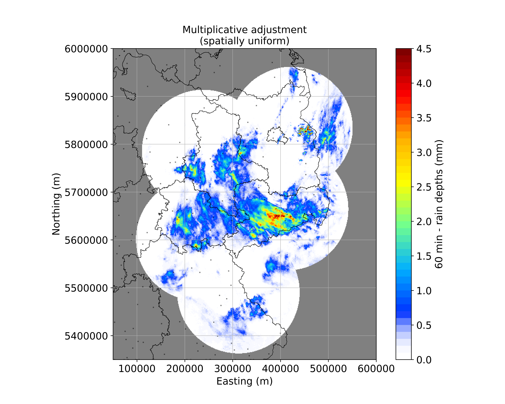
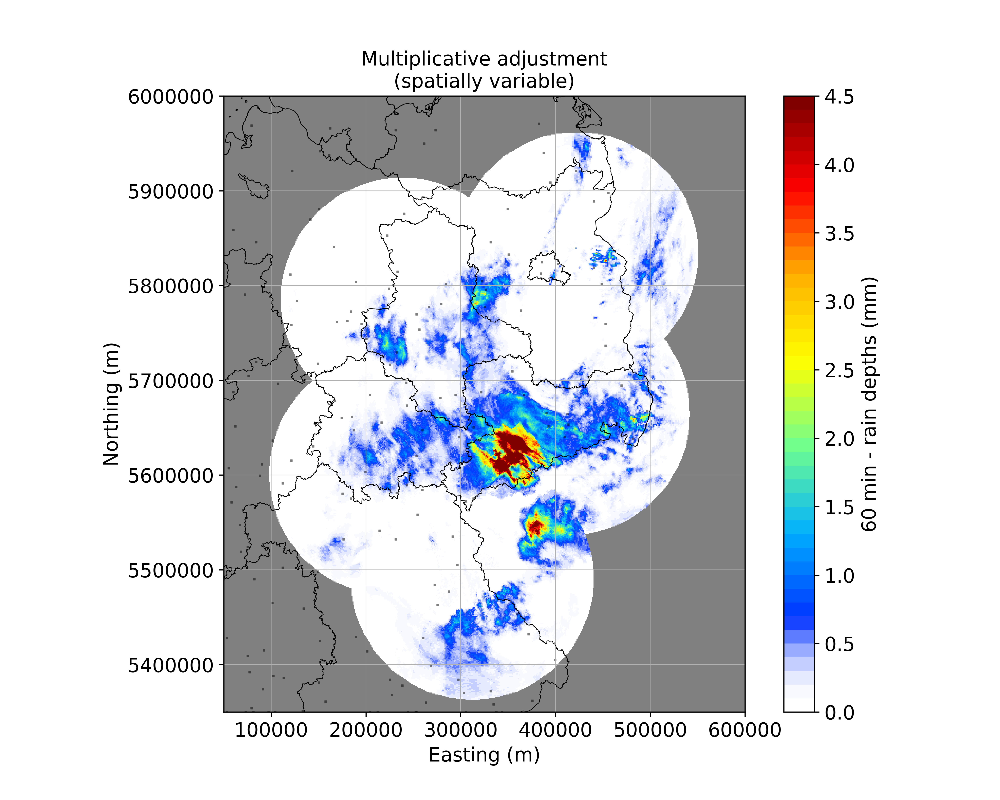

[](https://)
[](https://github.com/lenamueller/radar-gauge-adjustment/issues/)
[](https://)
[](https://)

## radar-gauge-adjustment
Shell script for scraping data from DWD's open data server and applying an adjustment for radar rainfall rates with gauge data. 

Create virtual environment with all required modules with  ```./create_venv..sh```.    
Run example case with ```./run_sample.sh```.   
Run latest radar images with ```./source run.sh``` (todo).


## Packages and Dependencies
pip 21.3.1
cartopy 0.20.2
DateTime 4.3
matplotlib 3.5.1
netCDF4 1.5.8
numpy 1.22.0
pandas 1.3.5
scikit-learn 1.0.2
scipy 1.7.3
wradlib 1.13.0
pint_xarray

## Workflow (test case 09.01.2019 12:00 UTC)
### 1. Read DX-data (Radar)
Data source: https://opendata.dwd.de/weather/radar/sites/dx/   


### 2. Correct clutter
Clutter identification, removal and data interpolation (algorithm by Gabella et al. 2002).


### 3. Correct attenuation
Calculate integrated attenuation for each bin (Kraemer et al. 2008, Jacobi et al. 2016).   
Upper left: attenuation error, upper right: radar image after attenuation correction, lower left: averaged attenuation by distance, lower right: individual attenuation for single azimuth angle (e.g. 270°)   


### 4. Derive rain depths
Apply Z-R-Relation (coefficients a=200 and b=1.6) and integrate rain rates for 60 min.   


### 5. Create composite and georeference
Requires step 1. to 4. for each radar site.   
Contains 60min rain accumulation for radar sites Dresden (drs), Ummendorf (umd), Neuhaus (neu), Eisberg (eis) and Prötzel (pro).   


### 6. Read RR-data (gauges)
Data source:  
1h-data: https://opendata.dwd.de/climate_environment/CDC/observations_germany/climate/hourly/precipitation/   
1min-data: https://opendata.dwd.de/climate_environment/CDC/observations_germany/climate/1_minute/precipitation/

### 7. Apply adjustment methods
#### hourly adjustment
 
 

#### 5min adjustment
todo

### 8. Evaluate adjustment methods
todo
