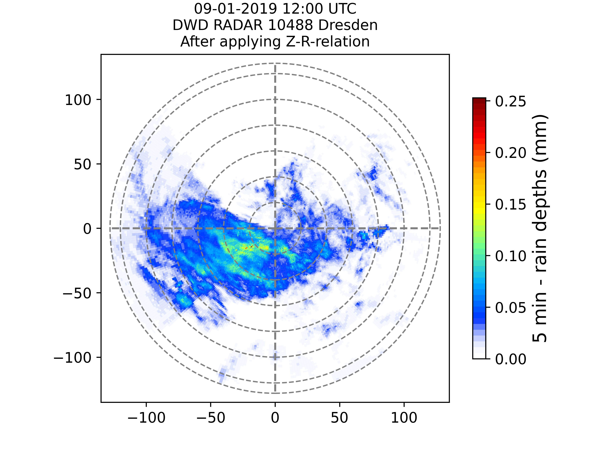
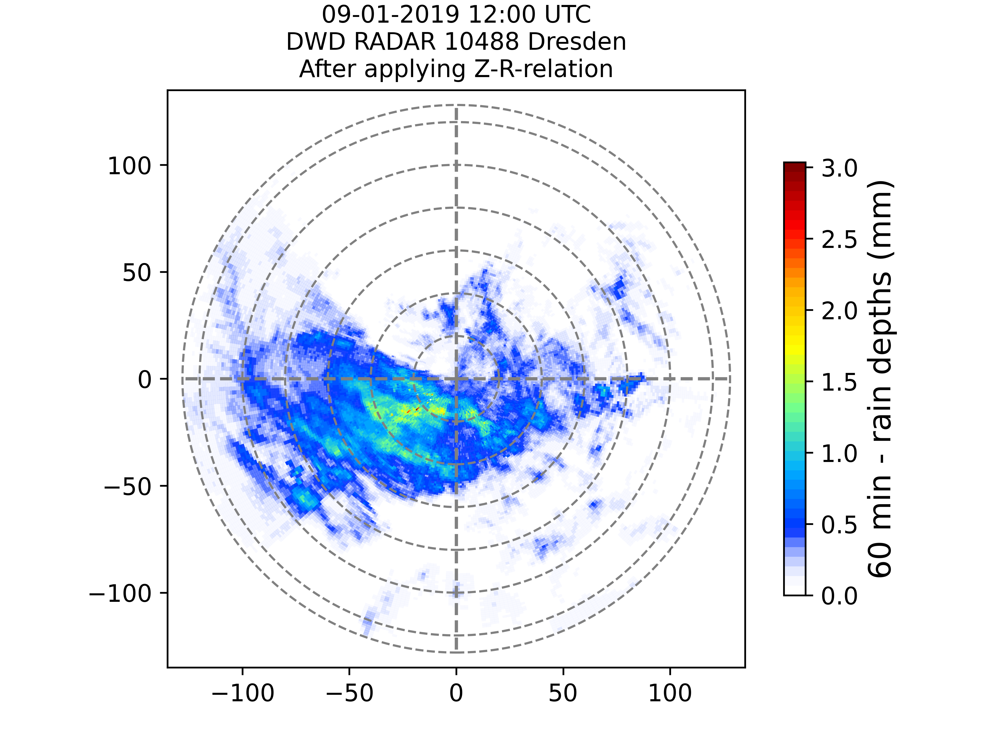
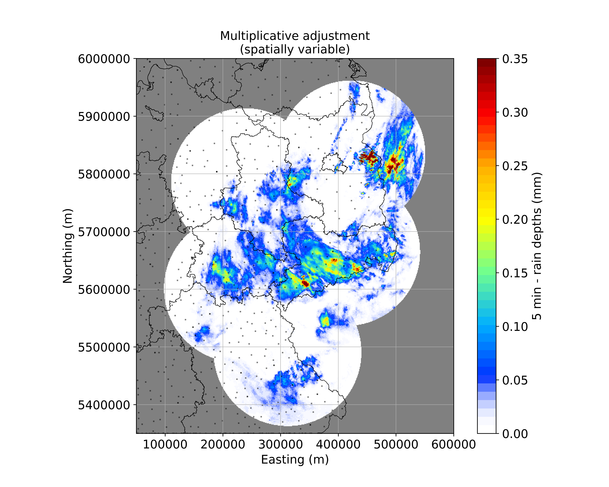

[](https://)
[](https://github.com/lenamueller/radar-gauge-adjustment/issues/)
[](https://)
[](https://)

## radar-gauge-adjustment
Shell script for scraping data from DWD's open data server and applying an adjustment for radar rainfall rates with gauge data on a 5 min and 60 min basis. 

Create virtual environment with all required modules with  ```./create_venv..sh```.    
Run example case (including gauge data download) with ```./run_sample.sh```.   

Made as part of the lecture MHYD06 "Angewandte Meteorologie für Hydrologen" at TU Dresden.

## Packages and Dependencies
pip 21.3.1
cartopy 0.20.2
DateTime 4.3
descartes 1.1.0
matplotlib 3.5.1
netCDF4 1.5.8
numpy 1.22.0
pyproj 3.3.0
scikit-learn 1.0.2
scipy 1.7.3
Shapely 1.8.0
wradlib 1.13.0
pint_xarray 0.20.2

## Workflow (test case 09.01.2019 12:00 UTC)
### 1. Read DX-data (Radar)
Data source: https://opendata.dwd.de/weather/radar/sites/dx/   


### 2. Correct clutter
Apply a clutter filter with a 5x5 moving window, 6 dBZ as a threshold for difference between central pixel and surrounding pixels and 1.3 as a threshold for the ratio between pixels in a group and pixel defining its boundary (parametrization suggested by M. Gabella and R. Notarpietro, 2002).   


### 3. Correct attenuation
Gate-to-gate algorithm to calculate the attenuation error and add it to the previous, clutter-corrected radar image to prevent an underestimation of precipitation (parametrization suggested by  Kraemer et al. 2008, Jacobi et al. 2016).   

   
Averaged attenuation by distance (left) and individual attenuation for single azimuth angle 270° as an example (right):


### 4. Derive rain depths
Apply Z-R-Relation with parametrization a=200 and b=1.6, suggested by J.S. Marshall and W. Palmer, 1948 and used by DWD for winter rain.
Integrate rain rates for 5 min (left) and 60 min (right).   



### 5. Create composite and georeference
Requires step 1. to 4. for each radar site.   
The composite cointains radar sites Dresden (drs), Ummendorf (umd), Neuhaus (neu), Eisberg (eis) and Prötzel (pro) for 5 min (left) and 60 min (right) precipitation accumulation. Intersections of multiple radar fields contain the maximum value.   
 

### 6. Read RR-data (gauges)
Data source:  
1h-data: https://opendata.dwd.de/climate_environment/CDC/observations_germany/climate/hourly/precipitation/   
1min-data: https://opendata.dwd.de/climate_environment/CDC/observations_germany/climate/1_minute/precipitation/

### 7. Apply adjustment methods
#### Additive adjustment with spatial differentiation
   
#### Multiplicative adjustment with spatial differentiation
   
#### Multiplicative adjustment with no spatial differentiation
   
#### Additive-multiplicative adjustment with spatial differentiation
   

Notice: The gray dots in the maps represent gauge stations. Due to the lack of gauge station data outside of Germany the interpolation there produces artifacts and don't allow a proper interpretation of the rain field there is tricky.

### 8. Evaluate adjustment methods
todo
